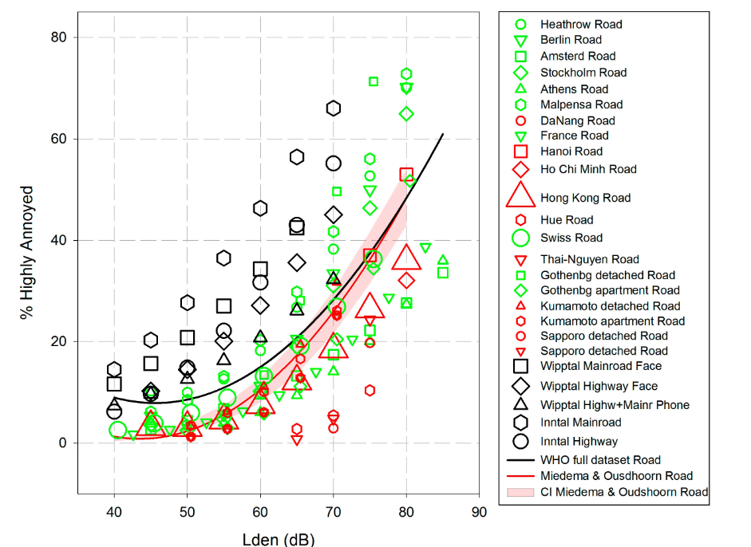

```{r setup, include=FALSE}
rm(list = ls())
#install.packages("directlabels")
#Versuch, ein Literaturverwaltungsschnittstelle zu nutzen
#update.packages(ask = FALSE)
#remotes::install_github("paleolimbot/rbbt")
#library(rbbt)# would be needed for Zotero-Integration
# Laden der für das Dokument benötitgten Pakete
library(knitr)
library(stringr)
library(kableExtra)
library(pander)
library(dplyr)
library(readr)
library(plotly)
library(flextable)
library(lubridate)
library(tidyr)
library(directlabels)

library(pdftools)
library(rsvg)
library(cachem)
library(fastmap)

# Setzen von globalen Chunk optionen, jeder Chunk gibt per default nicht den Code aus, keine R messages und auch keine R warnings
knitr::opts_chunk$set(echo = FALSE, 
                      message = FALSE,
                      warning = FALSE,
                      fig.align = "left")
```

```{r equationFunctions, cache = TRUE, include = FALSE}
# Definition von R Funktionen die zur Nummerierung von R Funktionen im Dokument verwendet werden.

is_docx_output <- function (fmt = knitr:::pandoc_to()) {
  if (length(fmt) == 0) {
    return(FALSE)
  } else {
    return(fmt == "docx")
  }
}
numberEq.docx <- function (eq, lab, envir = docx.eqcounter) {
  assign(x = "counter", value = get(x = "counter", envir = envir)+1, envir = envir)
  assign(x = gsub("eq:", "", lab), value = get(x = "counter", envir = envir), envir = envir)
  lab <- get("counter", envir = envir)
  return(paste0('$$', eq, '\\;\\;\\;\\;(', lab, ')', '$$'))
}

labEq.docx <- function (lab, envir = docx.eqcounter) {
  return(paste0('(', get(x = gsub("eq:", "", lab), envir = envir), ')'))
}

docx.eqcounter <- new.env()
docx.eqcounter$counter <- 0

```

```{r imageFunctions, cache=TRUE, include=FALSE}
# Defintion von R Funktionen die bei der Einbindung von svg und pdf Bildern unterstützen.

get_image_info <- function(path, type = "svg") {
  
  if (!type %in% c("svg", "pdf")) stop("type needs to be a svg or pdf")
  
  if (type == "svg") {
    info <- magick::image_read_svg(path) %>% 
      magick::image_info()
  }
  
  if (type == "pdf") {
    info <- magick::image_read_pdf(path) %>% 
      magick::image_info()
  }
  
  density <- info %>% 
    dplyr::pull(density) %>% 
    strsplit("x") %>% 
    unlist() %>% 
    head(1) %>% 
    as.numeric()
  
  width <- info$width/density
  height <- info$height/density
  
  return(list(
    density = density,
    width = width,
    height = height
  ))
}

```

```{r AnalyseSetup, include=FALSE}

# Laden der speziell für die Analyse benötigten zusätzlichen Pakete
#install.packages("dmetar")
library(meta)
library(metafor)
#library(dmetar)
library(tidyverse)
library(janitor)
library(readODS)
library(lme4)
```

```{r logo, eval=FALSE, fig.align='center', include=FALSE}
# Einbinden des Logos HLNUG auf das Deckblatt
# Derzeit deaktiviert

```

```{=html}
<!--
manueller Seitenumbruch mit \newpage
-->
```
\newpage

```{=html}
<!--
Einfügen eines Inhaltsverzeichnis, die Schreibweise benötigt das Paket officedown, 
das Paket ermöglicht uns eine praktische Einbindung von Abbildungsverzeichnissen und Tabellenverzeichnissen, "seq_id: 'fig'" definiert das in das Verzeichnis Abbildungen eingetragen werden sollen, "seq_id: 'tab' das Tabellen eingetragen werden sollen
-->
```
[**Table of content**]{.underline}

<!---BLOCK_TOC--->

```{=html}
<!--
"##" für Überschrift Typ 2
-->
```
[**List of figures**]{.underline}

<!---BLOCK_TOC{seq_id: 'fig'}--->

\listoffigures

[**List of tables**]{.underline}

<!---BLOCK_TOC{seq_id: 'tab'}--->

\listoftables

\newpage

The analysis an the report was written in RMarkdown. See e.g. @xie2015 .

# Scientific Starting Point

In order to estimate the environmental burden of disease of road noise, it is neccessairy to calculate the number of highly annoyed persons. The contribution of annoyance to the noise burden amounts to roughly half the total value of the total attributable burden[@Tobollik2019; @Hegewald2021]. As an important proportion of the hessian population is expected to be exposed to road noise in the range of 40 to 50 dB(A) *L~DEN~* the behavior of the exposure-response-relation (ERR) for high annoyance is of special interest. Especially the application of health impact assessments of noise mitigation measures, such as a hypothetical uniform reduction of all road noise sources by 3 dB, highlights the problematic aspect of the Guski[@Guski2017] as depicted in fig. \@ref(fig:Originalgraph): It is counter-intuitive, that there is a local minimum of annoyance at about 45 dB(A) *L~DEN~*. By reducing the exposure in this range by 3 dB, the ERR calculated burden might increase. Does the literature justify this counterintuitive result? In my opinion it does not.

```{r Originalgraph, fig.cap="Original Graph of Guski", fig.width=6.7}


# knitr::knit_hooks$set(plot = function(x, options)  {
#   paste0(knitr::hook_plot_tex(x, options), "\n\\FloatBarrier\n")
# })

```

The ERR used here corresponds to the "WHO full dataset road", indicated by the black line. The key numbers of the ERR are listed in Tab. \@ref(tab:fullErrGuski).

```{r ERRfullData, tab.id = "fullErrGuski", tab.cap = "Data values of the ERR for road traffic noise of the full data set as stated by [@Guski2017]"}
# Erstellung von Tabellen mit dem Paket flextable, das Paket ist darauf optimiert Word kompatible Tabellen zu erstellen.

ERRfull <- function(L) {
  78.9270-3.1162*L+0.0342*L^2
}
Lmin<-3.1162/2/0.0342
data.frame(LDEN = c(40, Lmin, 2 * Lmin - 40, 55, 60, 70, 80)) %>%
  mutate(
    `Full dataset %HA` = ERRfull(LDEN),
    ratio = `Full dataset %HA` / ERRfull(40)
  ) %>%
  round(digits = 2) %>% 
  mutate(comment = c(
      "negative slope",
      "minimum",
      "initial value",
      "inital value + 2%",
      "94% of population below",
      "",
      ""
    )) %>% 
  flextable(  cwidth = 1)# erstellen einer Tabelle
```

In the 15 dB-range from 40 to 55 dB, the annoyance value stays more or less constant; in the range of 9±2 %HA. This would mean, the annoyance by road traffic noise in the range 40 to 55 dB is rather high, but quite insensitive to the actual noise level. The annoyance at higher levels is moderately increasing compared to the starting value at 40 dB. All these conclusions seem to contradict intuition. All these mathematical properties (rather high starting point, negative slope, minimum point, little variation over a 15 dB-range, moderate increase with respect to the starting point) distinguish this congregated dataset from all individual study datasets. In my opinion, this difference is due to a meta-analysis method, which does not adequately respect the inter-study systematic differences. I.e. the annoyance at a given level L_0, of study I, %HA_i (L_0) probably strongly correlates with the lower end of the examined exposure level range L\_(Lo,i). An alternative approach to the given meta-analysis could be:

-   Choosing an appropriate parametrization for the ERR with reasonable boundary conditions (e.g. polynom of 1st or 2nd degree, no negative slope in the range 40 to 80 dB, ...)

-   Fitting the parameters to all individual study data sets separately. Aggregating the fit parameters, weighted with an adequate weight (i.e. √N_i, where N is the study size and i the individual study)

-   Use the log- (or logit-)transformed y-values and a logistic regression. This would force the functions to have a realistic asymptotic behaviour to low (and high) *L~DEN~*-values and still take into account the influence of all studies even out of the repectives studies range.

# Data wrangling

Both, Rainer Guski as well as Benjamin Fenech [@Fenech] provided me their data tables as ods-spredsheet. As a start I imported the road noise annoyance data and reformatted them in a tidy format in the sense of R[^1]. Then I manually added the information of the study region (Europe, Africa, Asia or America). [To be reviewed].

[^1]: For an explanation of tidy data see e.g.: <https://r4ds.had.co.nz/tidy-data.html>

```{r data}
# read and tidy raw data from Guski and Fenech
cellRanges<-c("A1:AM29","A2:BA48")
inpath<-c("data/WHO Annoyance Data Road 2017_Namen_einheitlich.ods","data/Fenech et al. Internoise 2022 road.ods")
outpath<-"graphs/"


#get_num_sheets_in_ods(inpath[i])
#list_ods_sheets(inpath[i])
readRaw <- function(path, whichCells) {
  odsData <- read_ods(
    path = path,
    col_names = TRUE,
    col_types = NULL,
    na = "",
    skip = 0,
    formula_as_formula = FALSE,
    range = whichCells,
    # row_names = TRUE,
    strings_as_factors = FALSE,
    verbose = FALSE
  )
  return(odsData)
}

i<-1#Guski dataset
raw<-readRaw(inpath[i],cellRanges[i])
regrList <-
  raw %>% select(Lden, contains(c("M&O", "Regr", "Perc"))) %>%
  .[complete.cases(.[, 2:4]),]# Use only fit results from Guski dataset everything else is redundant to Fenechs dataset
write.csv2(regrList,file="data/WHOAnnoyanceRegression.csv",row.names=FALSE)


regrListTidy<-read_delim("data/WHOAnnoyanceRegressionTidy.csv", 
    delim = ";", escape_double = FALSE, locale = locale(date_names = "de", 
        decimal_mark = ",", grouping_mark = "."), 
    na = "NA", trim_ws = TRUE)

i<-2#Fenech dataset
raw<-readRaw(inpath[i],cellRanges[i])

nList <- raw[c("Location", "N Location", "Sqrt N/10")] %>%
  clean_names(., "none") %>%
  mutate(Location=str_replace(Location, "%HA ", "")) %>%
  mutate(Location=str_replace(Location, " Road", "")) %>%
  .[complete.cases(.), ] %>%
  mutate(N = N_Location,
         Sqrt_N_10 = NULL,
         .keep = "unused")
write.csv2(nList,file="data/MetadataStudies.csv",row.names=FALSE)
nListTidy<-read_delim("data/MetadataStudiesTidy.csv", 
    delim = ";", escape_double = FALSE, locale = locale(date_names = "de", 
        decimal_mark = ",", grouping_mark = "."), 
    na = "NA", trim_ws = TRUE)


HAList <- raw %>%
  select(Lden, starts_with("%HA")) %>%
  select(!contains("M&O")) %>%
  rename_all(.,  ~ str_replace(., "%HA ", "")) %>%
  rename_all(.,  ~ str_replace(., " Road", "")) %>%
  pivot_longer(
    .,
    cols = !contains("Lden"),
    names_to = "Location",
    values_to = "ProzHA"
  ) %>%
  .[complete.cases(.), ] %>%
  left_join(., nListTidy) %>%
  group_by(Location)

HAList<-HAList %>% mutate(Location=as.factor(Location))

```

The beginning of the input data is listed in table \@ref(tab:reviewInput).

```{r tabelleRev, tab.id = "reviewInput", tab.cap = "The first 10 rows of the input data, each line denoting one dot in the above graph. The column listedBy denotes either the publication of Guski (G) or Fenech (F)"}
# Erstellung von Tabellen mit dem Paket flextable, das Paket ist darauf optimiert Word kompatible Tabellen zu erstellen.

HAList[1:10,] %>% 
   flextable()# erstellen einer Tabelle

```

The studies listed in table \@ref(tab:StudiesWFewPoinst) have less than 3 data points and will be ignored for the first guess analysis, in order to be able to perform meaningful fits on individual studies. For further refinement, also these studies will need to be included.

```{r tabelleFewPt, tab.id = "StudiesWFewPoinst", tab.cap = "Location and number of datapoints of those studies with less than 3 datapoints. These studies will be ignored for the first guess analysis."}

HAList %>% 
  tally() %>% 
  mutate(n_Points=n,.keep="unused") %>% 
  filter(n_Points<3) %>% 
  flextable()

```

The fitting relies on the R-Package [@lme4]. More background theory can be found in the online book of Mathias Harrer [@harrer2021doing]. As a first guess, I transform the response - here given as %HA -  to the log of response log(%HA). As one study states %HA=0, and log(0) is not defined, one needs to find a workaround. For the first guess, I just omit these data points.
As a second approach, I fit the regions seperately.

```{r Fitvorgang, echo=FALSE}

HAListFinite <- HAList %>%
  filter(n() >= 3) %>% # ignore studies with less than 3 datapoints
  filter(ProzHA > 0) #if using log, one needs to deal with response 0... As first step, I ignore them by filtering
HAmodel <- lmer(log(ProzHA) ~ Lden + (Lden |
                               Location), HAListFinite, weights = sqrt(N))
HAmodelReg <- lmer(log(ProzHA) ~ Lden + (Lden |
                               Region), HAListFinite, weights = sqrt(N))

HAListFinite$fit<-predict(HAmodel)
HAListFinite$RegionFit<-predict(HAmodelReg)
HAListFinite$logFitAll<-predict(HAmodel,re.form=NA)
myFitRes<-HAListFinite %>% 
  ungroup() %>% 
  select(Lden,logFitAll,Region,RegionFit) %>% 
  unique()
HAmodel
HAmodelReg

```

# Results/Discussion

The result of the global quadratic fit of Guski, as found in the data is plotted in Fig. \@ref(fig:GuskiFromData). 

```{r GuskiFromData, echo=FALSE, fig.cap="The quadratic fit of the full dataset as provided in the data including the 5%-95% confidence band.", fig.width=6.7}

# 'angle=90', out.extra='angle=90'
HAListFinite <-
  HAListFinite %>%
  mutate(LocationShort = substr(Location, 1, 15))

plWHOfit <-
  regrListTidy %>%
  ggplot(aes(x = Lden, y = prozHA)) +
  geom_line(aes(color = Source),
            linewidth = 1,
            na.rm = TRUE) +
  geom_ribbon(
    aes(ymin = lower,
        ymax =  upper,  fill = Source),
    outline.type = "both",
    alpha = 0.15
  ) +
  labs(x=expression(L[DEN]~"[dB(A)]"),y="%HA")


color4 <- c("black", "red", "blue", "green")
plWHOlin<-plWHOfit +
  scale_color_manual(name = "Source of fit",
                     values = color4) +
  scale_fill_manual(name = "Source of fit",
                    values = color4) +
  theme_bw(base_size = 10)
plWHOlin
#  facet_wrap(vars(Source))+


```

The same plot can be plotted on a logharitmic scale. In this way, the discrepancy at the lower end of the LDEN-scale are more obvious.

```{r GuskiFromDataLog, echo=FALSE, fig.cap="Again, the result of Guski and Miedema, but now on a logharitmic scale.", fig.width=6.7}
plWHOlin+ scale_y_log10()
```

In fig. \@ref(fig:logisticFitLog), I plot the result of my meta regression and in fig. \@ref(fig:logisticFitLogFacet) plotted on a separate facet for each input data set.

```{r logisticFitLog, fig.cap="The dataset excluding studies with less than 3 datapoints and datapoints with zero annoyance. The black line is my logistic regression, the gray line are the respective results of the mixed effect fit taking the variable region into account. Here, I show only the Percentate of highly annoyed from 0.2 Percent, although some datapoints have lower values.", fig.width = 6.7,fig.height=8.66}


vglFit <- ggplot(HAListFinite, aes(x = Lden)) +
  geom_point(aes(
    y = ProzHA,
    size = sqrt(N) / 20,
    color = Location
  )) +
  geom_line(aes(y = exp(fit),
                color = Location))  +
  geom_dl(
    aes(
      y = exp(fit),
      label = Location,
      color = Location
    ),
    method = list(dl.combine("last.points"), show.legend = F),
    cex = 0.8
  ) +
  geom_line(
    data = myFitRes,
    aes(y = exp(logFitAll),
        color = "global log fit"),
    linewidth = 2,
    color = "black"
  ) +
  geom_line(
    data = myFitRes,
    aes(y = exp(RegionFit),
        color = "mixed effects log fit"),
    linewidth = 2,
#    linetype = factor(Region),
    color = "grey"
  )+
  labs(x=expression(L[DEN]~"[dB(A)]"),y="%HA")+
scale_y_log10(n.breaks = 10) +
  coord_cartesian(ylim = c(0.2, 120)) +
  guides(color = "none") +
  theme_bw() + #base_size = 6) +
  theme(
    #legend.position = "bottom",
    legend.key.size = unit(0.5, 'cm'),
    #change legend key size
    legend.key.height = unit(0.5, 'cm'),
    #change legend key height
    legend.key.width = unit(0.5, 'cm'),
    #change legend key width
    legend.title = element_text(size = 8),
    #change legend title font size
    legend.text = element_text(size = 7)
  )+facet_wrap(vars(Region))
vglFit 

```

```{r logisticFitLin, fig.cap="The same dataset and my logistic regression, now with linear y-Axis.", fig.width = 6.7,fig.height=8.66}

vglFit+scale_y_continuous()

```

```{r logisticFitLogFacet, fig.cap="the same as previous figure \\@ref(fig:logisticFitLog), now each study in its own Graph.", fig.width = 6.7,fig.height=8.66}
plWHOfit +
  geom_point(data = HAListFinite, aes(
    y = ProzHA,
    size = sqrt(N) / 20,
    color = Location,
    show.legend = F
  )) +
  #geom_line(data = HAListFinite, aes(y = exp(fit)),color = Location,show.legend = F) +
  geom_line(
    data = HAListFinite,
    aes(y = exp(logFitAll),
        color = "mixed effects log fit"),
    linewidth = 1,
    color = "black"
  ) +
  # geom_dl(
  #   data = HAListFinite,
  #   aes(
  #     y = exp(fit),
  #     label = Location,
  #     color = Location
  #   ),
  #   method = list(dl.combine("last.points"), show.legend = F),
  #   cex = 0.8
  # ) +
  facet_wrap(Region+Location~., labeller = labeller(.multi_line=FALSE)) +
  theme_bw(base_size = 8) +
  scale_color_discrete(guide =NULL) +
  scale_fill_discrete(guide =NULL)  
  #scale_size_continuous(guide = NULL)
  # scale_alpha_manual(name = NULL,
  #                    values = c(1, 1, 1),
  #                    guide = NULL)


```

# Bibliography
